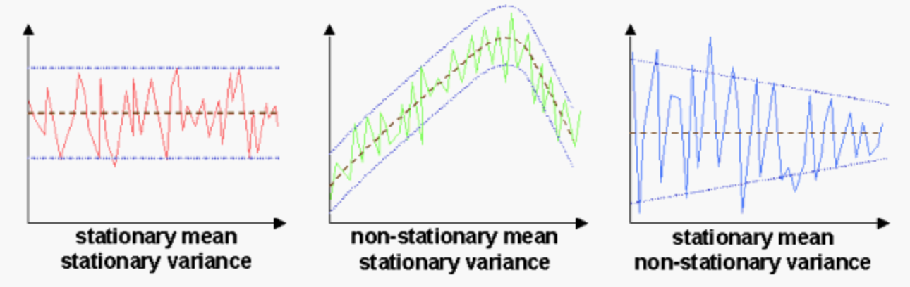

Let's start by looking at comparisons between time-series models and non-time series models:

| Aspect                  | Time-Series Models                          | Non-Time Series Models                         |
|-------------------------|---------------------------------------------|------------------------------------------------|
| **Nature of Data**      | Sequential data points ordered by time      | Independent samples without time ordering     |
| **Assumptions**         | Assumes time dependencies and trends        | Assumes independence among data points         |
| **Feature Engineering** | May involve lagged variables, seasonality adjustments| Feature selection, scaling, and transformation |
| **Model Types**         | ARIMA, SARIMA, Exponential Smoothing, LSTM  | Linear Regression, Decision Trees, Random Forest etc.|
| **Complexity**          | Can handle complex temporal patterns        | May struggle with time dependencies and trends|
| **Evaluation Metrics**  | RMSE, MAE, AIC, BIC, ACF, PACF              | Accuracy, Precision, Recall, F1 Score, R-squared|
| **Handling Seasonality**| Can capture seasonal variations             | May require manual feature engineering for seasonality|
| **Data Preprocessing**  | Focus on stationarity, differencing, seasonality adjustments| Standard preprocessing techniques such as scaling|

This comparison highlights the key differences between time-series models, which are specifically designed to handle temporal data with dependencies and trends, and non-time series models, which are more generalized and typically assume independence among data points. Depending on the nature of the problem and the data available, one would choose between these two categories of models for effective analysis and prediction.

## What is a time series?
A time series is a sequence of data points collected and recorded at successive time intervals, typically at regular intervals (e.g., hourly, daily, monthly).

Time series data often exhibits patterns, trends, seasonality, and irregular fluctuations over time.

- **Trend**: Long-term movement or direction of the data, indicating overall growth or decline. Trends can be upward (increasing), downward (decreasing), or flat (constant).
- **Seasonality**: Regular and predictable patterns that repeat at fixed intervals, such as daily, weekly, or yearly cycles. Seasonal patterns often occur due to factors like weather, holidays, or economic cycles.
- **Cyclic Patterns**: Longer-term fluctuations that do not have fixed periods. They may occur over multiple years and are often associated with economic cycles or business cycles.
- **Irregularity/Noise**: Irregularity or noise refers to random fluctuations or irregular variations in the data that are not explained by trend, seasonality, or cyclic patterns. 

## ARIMA
ARIMA stands for "Autoregressive Integrated Moving Average". It is like a detective that looks at how things change over time. It checks if something happening now is related to what happened before or if it's just random. And if the correlation stands true, ARIMA can be used to predict the future. 

### What does it assume?
ARIMA (Autoregressive Integrated Moving Average) relies on several key assumptions to ensure the validity and reliability of its forecasts. These assumptions are fundamental to the model's functioning and interpretation of results:

#### Stationarity
The time series data should exhibit stationarity, meaning its statistical properties like mean, variance, and autocorrelation structure remain constant over time.



Stationarity ensures that the relationships observed in the past data are likely to hold in the future, allowing ARIMA to make meaningful predictions.

- **Visual Inspection**: Plot your time series data over time and check for any trends, seasonality, or significant changes in mean and variance. Stationary data should have a relatively constant mean and variance over time.
- **Statistical Tests**: Use statistical tests like the Augmented Dickey-Fuller (ADF) test or Kwiatkowski-Phillips-Schmidt-Shin (KPSS) test to formally test for stationarity. ADF tests for the presence of a unit root, while KPSS tests for trend stationarity.

#### Linearity
ARIMA assumes that the relationships between variables in the time series (e.g., current and past observations) are linear.

Linearity simplifies the modeling process and facilitates the interpretation of coefficients in the model.

- **Visual Inspection**: Create scatterplots between variables of interest (e.g., current and lagged observations) to visually inspect for linear relationships.
- **Correlation Analysis**: Calculate Pearson correlation coefficients to quantify the strength and direction of linear relationships between variables.

#### Absence of Seasonality
If the time series exhibits seasonal patterns (e.g., daily, weekly, or monthly cycles), ARIMA may not be suitable unless a seasonal component (SARIMA) is added.

Seasonality can introduce additional complexity and patterns that ARIMA may not capture effectively without a seasonal component.

- **Seasonal Decomposition**: Use techniques like seasonal decomposition of time series (e.g., STL decomposition) to separate the time series into trend, seasonal, and residual components. Check if the seasonal component is significant.
- **Autocorrelation Function (ACF)**: Plot the ACF and Partial Autocorrelation Function (PACF) to identify significant seasonal patterns in the data.

#### Independence of Residuals
The residuals (errors) of the model should be independent of each other, indicating that any remaining patterns or information not captured by the model are random.

Independent residuals ensure that the model has captured all systematic patterns in the data, leaving only random fluctuations.

- **Residual Analysis**: Fit an initial ARIMA model to your data and analyze the residuals. Plot the residuals over time and check for patterns, trends, or autocorrelation. Use Ljung-Box test or Durbin-Watson statistic to formally test for autocorrelation in residuals.
- **White Noise Test**: Perform a white noise test on the residuals to ensure they are random and independent.

#### Constant Variance
The variance of the residuals should remain constant over time, ensuring that the model's predictions are equally reliable across different time periods.

Constant variance indicates that the model's performance does not degrade or improve significantly as time progresses.

- **Residual Variance Plots**: Plot the variance of the residuals over time to check for constant variance. Alternatively, calculate rolling standard deviations to assess changes in variability.
- **Homoscedasticity Tests**: Conduct tests like the Breusch-Pagan test or Goldfeld-Quandt test to formally test for homoscedasticity (constant variance) in the residuals.

#### No Multicollinearity
In the presence of multiple predictor variables (in the case of multivariate ARIMA), multicollinearity (high correlation between predictors) should be avoided to prevent numerical instability and unreliable coefficient estimates.

Multicollinearity can lead to inflated standard errors and misleading interpretations of the relationships between variables.

- **Correlation Matrix**: Create a correlation matrix for all predictor variables to check for high correlations (multicollinearity). Remove highly correlated variables or use dimensionality reduction techniques if multicollinearity is present.

While these assumptions provide a solid foundation for using ARIMA effectively, it's crucial to validate them through exploratory data analysis (EDA) and diagnostic checks during model development. Violations of these assumptions may require alternative modeling approaches or adjustments to the data before applying ARIMA.

## Example 
Suppose you're tracking the temperature every day. ARIMA helps predict if tomorrow's temperature will be similar to yesterday's or if it will change a lot.

- Autoregressive (AR) Component:
Imagine you're tracking the temperature every day. The AR part of ARIMA looks at how today's temperature depends on yesterday's temperature, the day before, and so on.
For example, if the temperature is getting warmer each day, the AR part helps predict that tomorrow will also be warm because of the trend it noticed in past days.
- Moving Average (MA) Component:
Now, let's say there are sudden ups and downs in temperature that don't seem related to past days. The MA part of ARIMA helps understand these sudden changes or spikes.
For instance, if yesterday was unusually hot but today is normal again, the MA part helps recognize that yesterday's heat was probably just a random event.
- Integrated (I) Component:
Sometimes, data might have a pattern that repeats regularly, like a weekly or monthly cycle. The I part of ARIMA helps remove these regular patterns to focus on the overall trend.
For instance, if temperatures go up every weekend but stay constant during weekdays, the I part helps remove this weekly cycle to see if there's a long-term warming trend.

Sure, let's break down the weather example using mathematical equations to explain how ARIMA checks if something happening now is because of what happened before or if it's just random.

1. **Autoregressive (AR) Component**:
   - The autoregressive component of ARIMA is represented by the equation:
     \[
     Y_t = \phi_1 \cdot Y_{t-1} + \phi_2 \cdot Y_{t-2} + ... + \phi_p \cdot Y_{t-p} + \epsilon_t
     \]
   - In our weather example, let's say \( Y_t \) represents today's temperature, \( Y_{t-1} \) represents yesterday's temperature, and so on. The equation shows that today's temperature depends on past temperatures (yesterday, the day before, etc.) weighted by coefficients \( \phi_1, \phi_2, ... \phi_p \).

2. **Moving Average (MA) Component**:
   - The moving average component of ARIMA is represented by the equation:
     \[
     Y_t = \mu + \epsilon_t + \theta_1 \cdot \epsilon_{t-1} + \theta_2 \cdot \epsilon_{t-2} + ... + \theta_q \cdot \epsilon_{t-q}
     \]
   - Here, \( \mu \) is the average temperature, \( \epsilon_t \) represents random fluctuations, and \( \theta_1, \theta_2, ... \theta_q \) are coefficients that capture how past random fluctuations affect today's temperature.

3. **Integrated (I) Component**:
   - The integrated component in ARIMA is about differencing to remove trends. It's represented by \( \Delta Y_t = Y_t - Y_{t-1} \).
   - If temperatures have a weekly cycle (e.g., warmer on weekends), differencing helps remove this cycle to focus on long-term trends or irregular changes.

Putting it all together:
- If ARIMA's AR component (past temperatures' influence) has significant coefficients and captures a warming trend, it suggests that today's temperature is related to past temperatures due to the trend observed.
- If the MA component (random fluctuations) has significant coefficients and captures sudden spikes or drops, it suggests that today's temperature is influenced by random events, like a sudden heatwave or cold front.
- The integrated component helps remove regular cycles (like weekly temperature changes) to focus on broader trends or irregular changes in temperature.

By analyzing these components mathematically, ARIMA can distinguish between temperature changes caused by trends (AR component), random events (MA component), or regular cycles (integrated component), helping predict future temperatures more accurately based on past data patterns.